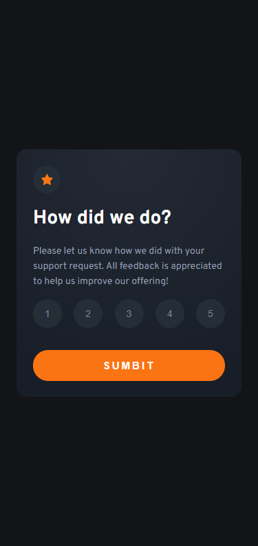
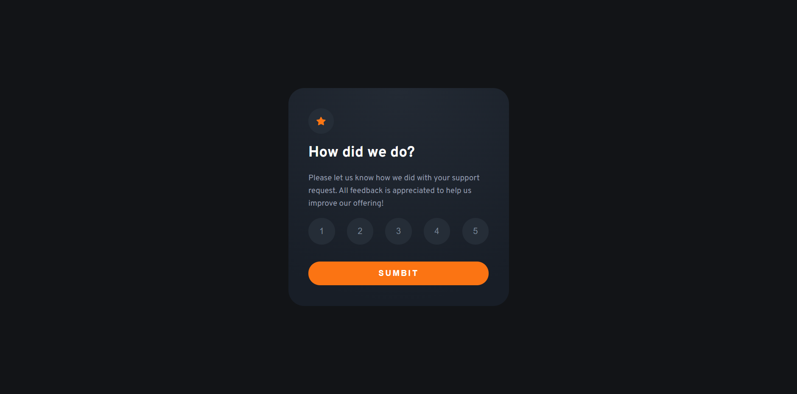

# Frontend Mentor - Interactive rating component solution

This is a solution to the [Interactive rating component challenge on Frontend Mentor](https://www.frontendmentor.io/challenges/interactive-rating-component-koxpeBUmI). Frontend Mentor challenges help you improve your coding skills by building realistic projects.

## Table of contents

-   [Overview](#overview)
    -   [The challenge](#the-challenge)
    -   [Screenshot](#screenshot)
    -   [Links](#links)
-   [My process](#my-process)
    -   [Built with](#built-with)
-   [Author](#author)
-   [Acknowledgments](#acknowledgments)

**Note: Delete this note and update the table of contents based on what sections you keep.**

## Overview

### The challenge

Users should be able to:

-   View the optimal layout for the app depending on their device's screen size
-   See hover states for all interactive elements on the page
-   Select and submit a number rating
-   See the "Thank you" card state after submitting a rating

### Screenshot

### Links

-   Solution URL: [solution URL here](https://github.com/NataJenkins/interactive-rating-component)
-   Live Site URL: [live site URL here](https://tourmaline-trifle-a88345.netlify.app)

## My process

I started creating both rating and submitted components. Used state to save the values and conditionally render the right component depending on the state

### Built with

-   Semantic HTML5 markup
-   CSS custom properties
-   Sass
-   Flexbox
-   [React](https://reactjs.org/) - JS library

## Author

-   Github - [NataJenkins](https://github.com/NataJenkins)
-   Frontend Mentor - [@NataJenkins](https://www.frontendmentor.io/profile/NataJenkins)
-   Linkedin - [natalia0896](https://www.linkedin.com/in/natalia0896/)
